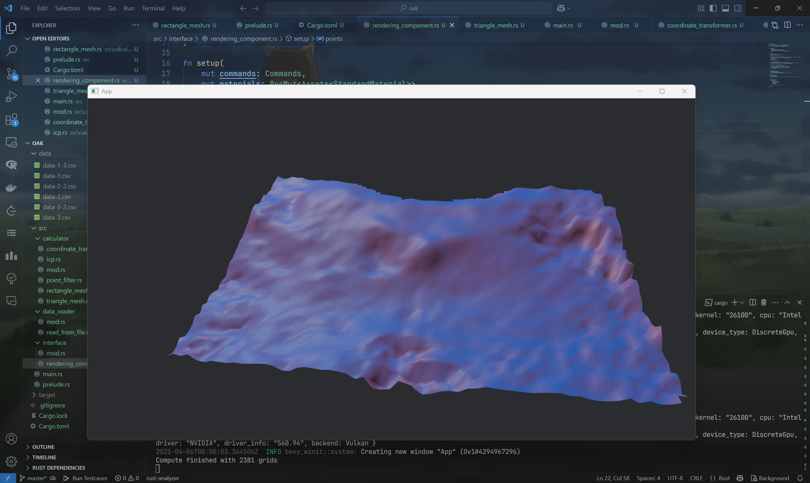
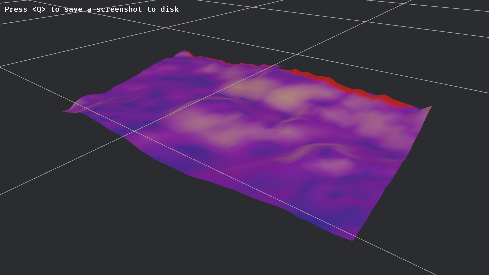

# Oak软件说明书

## 机载端

### 传感器数据采集

MID360通过以太网与机载电脑通信，协议为UDP。因此编写了UDP端口数据读取系统，能够绑定指定的端口来实现二进制数据的读取。代码如下：

``` rust
pub fn read_pointcloud(
    socket: &UdpSocket,
    duration: u32,
) -> SensorMessage<Vec<LaserData>> {
    let mut buf = [0; 65536];
    let mut data_buffer = Vec::new();
    let start_time = Instant::now();
    let mut vec_laser_data = Vec::new();
    socket.set_read_timeout(Some(Duration::from_millis(50))).expect("Failed to set Lidar socket timeout");

    loop {
        match socket.recv_from(&mut buf) {
            Ok((size, _addr)) => {
                if size == 0 {
                    return SensorMessage {
                        status: ConnectionState::Disconnected,
                        data: None,
                        timestamp: 0,
                    };
                }
                data_buffer.extend_from_slice(&buf[..size]);

                match parse_laserpoint(&data_buffer) {
                    Ok(data) => {
                        vec_laser_data.push(data);
                    }
                    Err(e) => {
                        return SensorMessage {
                            status: ConnectionState::Error(e.to_string()),
                            data: None,
                            timestamp: 0,
                        };
                    }
                }
                data_buffer.clear();

                if start_time.elapsed() > Duration::from_millis(duration as u64) {
                    return SensorMessage {
                        status: ConnectionState::Connected,
                        data: Some(vec_laser_data),
                        timestamp: start_time.elapsed().as_millis() as u64,
                    };
                }
            }
            Err(e) => {
                match e.kind() {
                    ErrorKind::WouldBlock | ErrorKind::TimedOut => {
                        return SensorMessage {
                            status: ConnectionState::Disconnected,
                            data: None,
                            timestamp: 0,
                        };
                    }
                    _ => {
                        return SensorMessage {
                            status: ConnectionState::Error(e.to_string()),
                            data: None,
                            timestamp: 0,
                        };
                    }
                }
            }
        }
    }
}

pub fn read_imu_data(
    socket: &UdpSocket,
) -> SensorMessage<ImuData> {
    let mut buf = [0; 2048];
    let mut data_buffer = Vec::new();
    socket.set_read_timeout(Some(Duration::from_millis(20))).expect("Failed to set IMU socket timeout");

    match socket.recv_from(&mut buf) {
        Ok((size, _addr)) => {
            data_buffer.extend_from_slice(&buf[..size]);

            match parse_imu(&data_buffer) {
                Some(imu_data) => {
                    let timestamp = imu_data.timestamp;
                    return SensorMessage {
                        status: ConnectionState::Connected,
                        data: Some(imu_data),
                        timestamp: timestamp,
                    };
                }
                None => {
                    return SensorMessage {
                        status: ConnectionState::Error("Failed to parse IMU data".to_string()),
                        data: None,
                        timestamp: 0,
                    };
                }
            }
        }
        Err(e) => {
            match e.kind() {
                ErrorKind::WouldBlock | ErrorKind::TimedOut => {
                    return SensorMessage {
                        status: ConnectionState::Disconnected,
                        data: None,
                        timestamp: 0,
                    };
                }
                _ => {
                    return SensorMessage {
                        status: ConnectionState::Error(e.to_string()),
                        data: None,
                        timestamp: 0,
                    };
                }
            }
        }
    }
}
```

由于点云数据和IMU数据分别由不同端口传输，通过分别指定端口实现对应数据的读取。

#### 点云数据读取系统

对于原始点云二进制数据，按照MID360的点云格式进行解析。代码如下：

``` rust
pub fn parse_laserpoint(data: &[u8]) -> Result<LaserData, Error> {
    const HEADER_SIZE: usize = 36;
    const POINT_SIZE: usize = 14;

    if data.len() < HEADER_SIZE {
        return Err(Error::new(
            ErrorKind::UnexpectedEof,
            format!("Packet too small ({} < {})", data.len(), HEADER_SIZE),
        ));
    }

    let mut cursor = Cursor::new(data);

    // 解析数据包头部(LaserPoint&IMU数据包)
    let version = cursor.read_u8()?; // 0: 协议版本
    let length = cursor.read_u16::<LittleEndian>()?; // 1-2: UDP 包长度
    let time_interval = cursor.read_u16::<LittleEndian>()?; // 3-4: 时间间隔
    let dot_num = cursor.read_u16::<LittleEndian>()?; // 5-6: data包含点云数量
    let udp_cnt = cursor.read_u16::<LittleEndian>()?; // 7-8: UDP包计数
    let farme_cnt = cursor.read_u8()?; // 9: 帧计数
    let data_type = cursor.read_u8()?; // 10: 数据类型
    let time_type = cursor.read_u8()?; // 11: 时间戳类型
    
    // 12-23: 保留字段 - 读取12字节
    let mut reserved = vec![0u8; 12];
    cursor.read_exact(&mut reserved)?;
    
    let crc32 = cursor.read_u32::<LittleEndian>()?; // 24-27: CRC32校验码
    let timestamp = cursor.read_u64::<LittleEndian>()?; // 28-35: 时间戳

    if data_type != 0x01 {
        return Err(Error::new(
            ErrorKind::InvalidData,
            format!("Unsupported data type: {}", data_type),
        ));
    }

    let length_usize = length as usize;
    if length_usize > data.len() {
        return Err(Error::new(
            ErrorKind::InvalidData,
            format!("Length field ({}) exceeds actual data ({})", length, data.len()),
        ));
    }

    // 解析点云数据
    let payload = &data[HEADER_SIZE..length_usize];
    if payload.len() % POINT_SIZE != 0 || dot_num as usize != payload.len() / POINT_SIZE {
        return Err(Error::new(
            ErrorKind::InvalidData,
            format!("Payload size {} is not multiple of point size {}", payload.len(), POINT_SIZE),
        ));
    }

    let point_count = payload.len() / POINT_SIZE;
    let mut points = Vec::with_capacity(point_count);
    let mut payload_cursor = Cursor::new(payload);
    let minimun_distance = 0.1f32;

    for _ in 0..point_count {
        let x = payload_cursor.read_i32::<LittleEndian>()? as f32 / 1000.0;
        let y = payload_cursor.read_i32::<LittleEndian>()? as f32 / 1000.0;
        let z = payload_cursor.read_i32::<LittleEndian>()? as f32 / 1000.0;
        let reflectivity = payload_cursor.read_u8()?;
        let _tag = payload_cursor.read_u8()?;

        if x.abs() < minimun_distance && y.abs() < minimun_distance && z.abs() < minimun_distance {
            continue;
        }

        let coordinate = Point3f::new(x, y, z);

        points.push(LaserPoint {
            coordinate,
            reflectivity,
            //tag,
        });
    }

    let laser_data = LaserData {
        version,
        length,
        time_interval,
        dot_num,
        udp_cnt,
        frame_cnt: farme_cnt,
        data_type,
        time_type,
        reserved,
        crc32,
        timestamp,
        points,
    };

    Ok(laser_data)
}
```

在处理数据时，同时完成了异常点的筛查，降低了噪声。

### 飞行避障系统

由于采集数据时需要低空飞行，存在碰撞障碍物的风险。基于激光雷达的全向扫描特性，制作了自动避障系统。
图中绿色细线即为已规划的路径，红色直线为对高风险障碍物的躲避建议方向。
该系统具有完全实时，响应速度高的特点，能很好的实现对动态/静态障碍物的全自动规避。
以下详细介绍避障系统。


#### 飞行控制子系统

为了让避障系统发布的命令被无人机正确执行，使用MavLink协议与PX4 Autopilot通信。
协议关键字如下：

``` rust
#[pyclass]
#[derive(Debug, Clone, Copy)]
pub struct MavlinkArgs {
    #[pyo3(get)]
    pub time_boot_ms: u32,
    #[pyo3(get)]
    pub target_system: u8,
    #[pyo3(get)]
    pub target_component: u8,
    #[pyo3(get)]
    pub coordinate_frame: u8,
    #[pyo3(get)]
    pub type_mask: u16,
    #[pyo3(get)]
    pub x: f32,
    #[pyo3(get)]
    pub y: f32,
    #[pyo3(get)]
    pub z: f32,
    #[pyo3(get)]
    pub vx: f32,
    #[pyo3(get)]
    pub vy: f32,
    #[pyo3(get)]
    pub vz: f32,
    #[pyo3(get)]
    pub afx: f32,
    #[pyo3(get)]
    pub afy: f32,
    #[pyo3(get)]
    pub afz: f32,
    #[pyo3(get)]
    pub yaw: f32,
    #[pyo3(get)]
    pub yaw_rate: f32,
}
```

在机上，避障系统的所有避障命令均通过该协议与飞控通信。

#### 威胁筛选系统

根据障碍物的距离和当前无人机行进方向，对沿途障碍物进行筛选，优先响应高威胁的障碍物。
障碍物的距离使用欧几里得距离计算，并进行排序以筛选高威胁障碍物。筛选完成后通过距离加权计算规避方向和速度向量，生成避障指令。相关函数如下：

``` rust
pub fn obstacle_avoidance(
    obstacle_list: &Vec<(f32, Point3f)>,
    warn_trigger_distance: f32,
    //mavlink_args: &MavlinkArgs,
) -> MavlinkArgs {
    const EPSILON: f32 = 1e-6;
    const MAX_SPEED: f32 = 1.0;
    let mut result = MavlinkArgs::new(
        0,
        1,
        1,
        9,
        0b0000001000000000,
        0.0,
        0.0,
        0.0,
        0.0,
        0.0,
        0.0,
        0.0,
        0.0,
        0.0,
        0.0,
        0.0,
    );
    if obstacle_list.is_empty() {
        return result;
    }
    let mut sorted_obstacle_list = obstacle_list.clone();
    sorted_obstacle_list.sort_by(|a, b| a.0.partial_cmp(&b.0).unwrap());
    if sorted_obstacle_list[0].0 > warn_trigger_distance {
        return result;
    }
    let (mut sum_x, mut sum_y, mut sum_z) = (0.0, 0.0, 0.0);
    for &(distance, coordinate) in &sorted_obstacle_list {
        let weight = 1.0 / (distance.powi(3) + EPSILON);
        sum_x += -coordinate.x * weight;
        sum_y += -coordinate.y * weight;
         sum_z += -coordinate.z * weight;
    }

    let _minimum_distance = sorted_obstacle_list[0].0;
    let speed = MAX_SPEED;

    let magnitude = (sum_x.powi(2) + sum_y.powi(2) + sum_z.powi(2)).sqrt();
    if magnitude < EPSILON {
        let (_, coordinate_closest) = sorted_obstacle_list[0];
        let dir_mag = distance(&coordinate_closest, &Point3f::new(0.0, 0.0, 0.0));
        if dir_mag < EPSILON {
            result.type_mask = 0b010111111111;
            result.yaw_rate = 0.5; // TODO: stop after a while
            return result;
        }
        else {
            result.type_mask = 0b0000001000000000;
            let vx = speed * -coordinate_closest.x / dir_mag;
            let vy = speed * -coordinate_closest.y / dir_mag; // Change O-XYZ to O-FRD
            let vz = speed * -coordinate_closest.z / dir_mag;
            let (vx, vy, vz) = mid360_to_frd(vx, vy, vz);
            result.vx = vx;
            result.vy = vy;
            result.vz = vz;
            return result;
        }
    }
    else {
        result.type_mask = 0b0000001000000000;
        let vx = speed * sum_x / magnitude;
        let vy = speed * sum_y / magnitude; // Change O-XYZ to O-FRD
        let vz = speed * sum_z / magnitude;
        let (vx, vy, vz) = mid360_to_frd(vx, vy, vz);
        result.vx = vx;
        result.vy = vy;
        result.vz = vz;
        return result;
    }
}
```

#### 路径规划器

采用人工势场法实现平滑效果的路径规划器。首先建立虚拟引力场，引力场方向指向目标点，计算公式如下：

``` rust
fn compute_attractive_force(
    current: &Point3f,
    goal: &Point3f,
    k_att: f32
) -> Point3f {
    let vec = goal - current;
    Point3f::new(
        vec.x * k_att,
        vec.y * k_att,
        vec.z * k_att,
    )
}
```

为每个障碍物建立斥力场，计算公式如下：

``` rust
fn compute_repulsive_force(
    current: &Point3f,
    obstacles: Vec<(f32, Point3f)>,
    k_rep: f32,
    d0: f32,
) -> Point3f {
    let mut f_rep = Point3f::new(0.0, 0.0, 0.0);

    for (d, point) in obstacles {
        if d <= d0 && d > 0.0 {
            let term = (1.0/d - 1.0/d0) * k_rep / d.powi(2);
            let vec = current - point;
            f_rep.x += vec.x * term;
            f_rep.y += vec.y * term;
            f_rep.z += vec.z * term;
        }
    }

    f_rep
}
```

在最大迭代步长内根据合力尝试移动到目标点，并生成对应的MavlinkArgs：

``` rust
pub fn apf_plan_mavlink(
    start: Point3f,
    goal: Point3f,
    octree_map: &HashMap<u32, Vec<(f32, LaserPoint)>>,
    config: &ApfConfig,
) -> Result<Vec<crate::api::MavlinkArgs>, ApfError<MavlinkArgs>> {
    use crate::api::MavlinkArgs;
    let mut mavlink_vec = Vec::new();
    if goal == Point3f::new(0.0, 0.0, 0.0) {
        mavlink_vec.push(MavlinkArgs::default());
        return Ok(mavlink_vec);
    }
    let mut path = vec![start];
    let mut current_pos = start;
    let mut steps = 0;
    let mut mavlink_args: MavlinkArgs = MavlinkArgs::default();

    while distance(&current_pos, &goal) > config.epsilon && steps < config.max_steps {
        let f_att = compute_attractive_force(&current_pos, &goal, config.k_att);
        let mut obstacle_list: Vec<(f32, Point3f)> = Vec::new();

        for (_, points) in octree_map {
            for point in points {
                let distance = distance(&current_pos, &point.1.coordinate);
                if distance < config.d0 {
                    obstacle_list.push((distance, point.1.coordinate));
                }
            }
        }
        let f_rep = compute_repulsive_force(&current_pos, obstacle_list, config.k_rep, config.d0);
        let f_total = add_forces(f_att, f_rep);

        if let Some(direction) = normalize(&f_total) {
            current_pos = Point3f::new(
                current_pos.x + direction.x * config.step_size,
                current_pos.y + direction.y * config.step_size,
                current_pos.z + direction.z * config.step_size,
            );
            path.push(current_pos);
            if path.length() == 1 {
                continue;
            }
            let velocity = path[path.length() - 1] - path[path.length() - 2];
            mavlink_args = MavlinkArgs {
                target_component: 0,
                target_system: 0,
                time_boot_ms: 0,
                coordinate_frame: 0,
                type_mask: 0,
                x: 0.,
                y: 0.,
                z: 0.,
                vx: velocity.x,
                vy: velocity.y,
                vz: velocity.z,
                afx: 0.,
                afy: 0.,
                afz: 0.,
                yaw: 0.0,
                yaw_rate: 0.0,
            };
            mavlink_vec.push(mavlink_args);
        } else {
            return Err(ApfError::LocalMinimum(mavlink_vec));
        }

        steps += 1;
    }

    if distance(&current_pos, &goal) <= config.epsilon {
        Ok(mavlink_vec)
    } else {
        Err(ApfError::MaxStepsReached(mavlink_vec))
    }
}
```

## 地面站端

### 数据分析

原始数据中得到的点云数据受到地面植被的影响，存在大量草地的噪点和灌木的小团簇。在进行地形建模前，需要首先去除植被的杂波。
首先使用聚类算法标记小团簇离群点云并去除，以实现去除低矮灌木的目的。
为了去除草地回波，使用RANSAC算法进行地面的粗拟合。
RANSAC是一种鲁棒性参数估计算法，通过迭代采样和验证从含噪数据中提取有效模型。首先从数据集中随机选取最小子集构建候选模型，再计算所有数据点到模型的残差，统计满足阈值（如距离平面<0.05m）的内点数量。通过迭代重复上述步骤，保留内点最多的模型，最终基于内点集重新拟合精确模型。
首先把数据集划分为多个确定大小的二维网格，每个网格内插入对应的点云。由微分几何，当网格尺寸远小于地形尺度时，地形曲面在网格内就可近似为平面。因此可以采用RANSAC算法进行平面拟合。随后随机取三个点云构建平面方程，并计算剩余点到平面的距离。对于距离小于阈值的点，则认为是模型的内点。通过反复迭代计算得到内点最多的点，则我们可以认为该模型即为实际地形平面。

### 地形重建

由于在预处理中已经进行了地面的粗拟合，因此为了节省计算资源，在上一步的基础上进一步计算。由于每个网格内平面方程已知，因此可以计算得到平面的法线方向等几何信息，反映为地形的坡度。把坡度与色彩进行映射，即可得到能直观反映地形起伏的三维地形。
重建效果如下：



### 异常分析

完成处理后，使用icp方法对准原始点云与当前点云。
ICP算法是一种通过迭代优化实现三维点云数据对齐的经典方法，其核心原理是通过不断寻找源点云与目标点云之间的最近点对应关系，并基于最小二乘法计算旋转平移矩阵，逐步将源点云变换至目标点云的坐标系下，直至误差收敛。点云配准后，在原始点云中搜索k近邻，并计算到原始点云网格平面的距离作为误差。对于误差超过阈值的部分，我们认为其发生了形变，即可进行标注，并在渲染结果中高亮表示。



### 三维观测系统

计算完成后，可以使用三维观测系统进行360°观测重建的地形，并任意选取位置截图保存以供分析。
