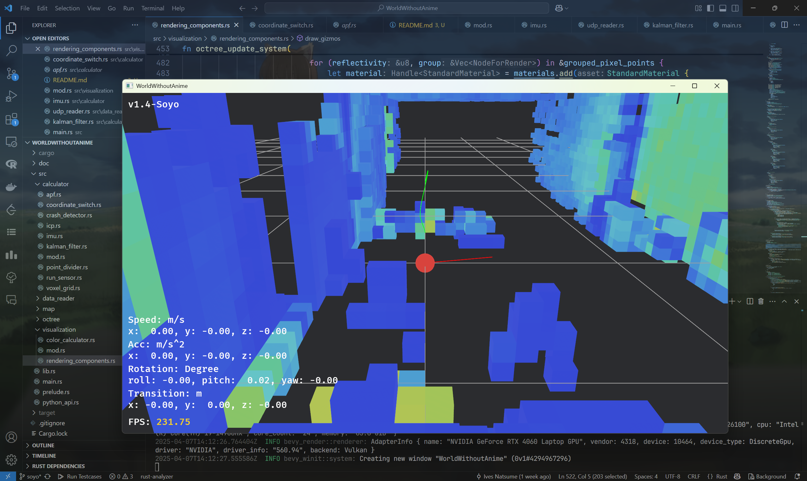

# Oak软件说明书

## 机载端

### 点云数据的采集

待无人机稳定悬停后，连续采集1000ms的点云信息。MID360的点云数据通过UDP协议传送，因此我们编写了相应的解析软件。该软件能绑定指定的数据传输端口，并按照MID360的点云格式进行二进制数据的解析。
在收集数据时同时完成对数据的预处理，包括去除异常点等。


### 飞行避障系统

由于采集数据时需要低空飞行，存在碰撞障碍物的风险。基于激光雷达的全向扫描特性，制作了自动避障系统。
图中绿色细线即为已规划的路径，红色直线为对高风险障碍物的躲避建议方向。
该系统具有完全实时，响应速度高的特点，能很好的实现对动态/静态障碍物的全自动规避。
以下详细介绍避障系统。



#### 飞行控制子系统

为了让避障系统发布的命令被无人机正确执行，使用MavLink协议与PX4 Autopilot通信。
协议关键字如下：

``` rust
#[pyclass]
#[derive(Debug, Clone, Copy)]
pub struct MavlinkArgs {
    #[pyo3(get)]
    pub time_boot_ms: u32,
    #[pyo3(get)]
    pub target_system: u8,
    #[pyo3(get)]
    pub target_component: u8,
    #[pyo3(get)]
    pub coordinate_frame: u8,
    #[pyo3(get)]
    pub type_mask: u16,
    #[pyo3(get)]
    pub x: f32,
    #[pyo3(get)]
    pub y: f32,
    #[pyo3(get)]
    pub z: f32,
    #[pyo3(get)]
    pub vx: f32,
    #[pyo3(get)]
    pub vy: f32,
    #[pyo3(get)]
    pub vz: f32,
    #[pyo3(get)]
    pub afx: f32,
    #[pyo3(get)]
    pub afy: f32,
    #[pyo3(get)]
    pub afz: f32,
    #[pyo3(get)]
    pub yaw: f32,
    #[pyo3(get)]
    pub yaw_rate: f32,
}
```

## 地面站端
